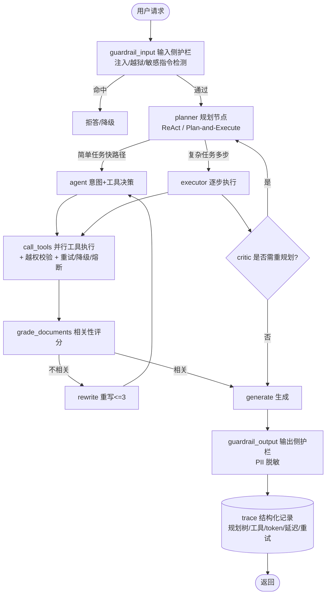

## 产品概述

针对个人开源项目 **enterprise-customer-service-agent**（基于 LangGraph 的企业智能客服 RAG Agent，最新版 `07_RagAgent_Business`），依据已调研的 **Agent 开发 / Agent 算法岗**（字节 A64991、百度 AIDU 智能体 J99969、百度 Agent Harness J100815、DeepSeek Agent Harness、京东安全 Agentic）的岗位要求，对项目进行能力补齐与升级，使其从"合格的 RAG Demo"跃升为"面试有竞争力的 Agent 作品"，并把候选人独家长板（网络安全 + vivo 提示词护栏）焊进项目。

## 核心功能（按优先级 P0 → P2）

### P0（决定面试成败，必做）

- **显式 Agent 规划范式**：新增 Planner 节点，把现有"意图→工具→评分→重写"固定 DAG 升级为 ReAct / Plan-and-Execute + 动态重规划，支持复杂查询多步拆解与失败回退。
- **Agent 行为层评测基准**：在现有检索层指标（hit@k + LLM-judge）之上，扩充任务成功率、工具调用准确率、多步完成率、无效 LLM 调用率、步数/延迟/token 成本；构建覆盖单工具/多工具/跨源/无解/对抗 5 类的评测集与基准对比表。
- **安全护栏层**：输入侧提示词注入/越狱检测（复用 vivo 7 类攻击范式）、输出侧 PII 脱敏、敏感工具越权校验、脱敏审计日志，并附攻击测试用例。

### P1（提升 Harness 工程成色）

- **可观测性 / Trace**：结构化记录规划树、每步工具、token、延迟、重试次数（P0 评测依赖此层）。
- **工具可靠性**：工具调用增加超时、重试（指数退避）、失败降级、熔断。
- **多智能体协作**：拆分 Planner / Executor / Critic 或领域子 Agent + Router，让"多 Agent"从简历文字变为代码事实。

### P2（加分与展示）

- 记忆检索质量评估 + 工具沙箱/执行约束 + 数据集扩充。
- README 架构图与核心指标表、版本精简说明、1–2 分钟 Demo（含一次注入被拦截）。

## 边界与约束

- 所有改动集中在 `07_RagAgent_Business/`，保持向后兼容，不破坏现有 5 节点工作流的快路径。
- 项目当前未在本地，实现前需先 clone 到工作区。
- 安全实现须遵守：外部输入按 HOSTILE 处理、PII 脱敏、工具越权校验（AuthZ）、审计日志不记全量敏感数据、密钥仅从环境变量读取。
- 本次仅产出计划，不改动任何代码。

## 技术栈选择

沿用项目现有技术栈，不引入不必要的新框架：

- **Agent 框架**：LangGraph（复用现有工作流图，新增节点）
- **LLM 生态**：LangChain / OpenAI SDK，多后端（Ollama / DeepSeek / OpenAI / 通义千问）热切换
- **向量库 / 存储**：ChromaDB + PostgreSQL(pgvector)
- **服务与 UI**：FastAPI + Uvicorn + Gradio
- **工具协议**：MCP（`mcp_server/tools_impl.py` 单一事实来源）
- **评测**：现有 `evals/`（dataset/judge/metrics/runner/trace）扩展 + `eval_rag.py` CLI
- **安全护栏**：规则匹配 +（可选）轻量分类器；语言 Python，遵循项目现有分层

## 实现策略与关键决策

### 总体策略

以"**在现有 5 节点工作流外挂能力**"为原则，最小侵入地补齐三块 P0 短板，避免推翻现有架构：

1. **规划范式（P0-A）**：在 `demoRagAgent.py` 的 `agent` 节点前/内插入 `planner` 节点，产出结构化计划（step 列表）；新增 `executor` 逐步执行 + observation 回填，`critic` 判断是否需要 replan。简单查询走原快路径（planner 直接输出单步），复杂跨源查询走 Plan-and-Execute，兼顾性能与能力。
2. **评测基准（P0-B）**：评测指标依赖 Trace 数据（故 P1-A Trace 是 P0-B 的前置或并行项）。在 `evals/` 新增 Agent 行为层指标计算与分类评测集，产出可写入 README 的基准对比表（不同规划策略/模型对比）。
3. **安全护栏（P0-C）**：新增 `guardrails/` 模块，作为工作流的 pre-hook（输入侧）与 post-hook（输出侧）+ 工具调用包装器（越权校验），与业务逻辑解耦，可通过配置开关。

### 关键技术决策与权衡

- **为何用节点插入而非重写工作流**：LangGraph 图结构支持增量加节点，复用现有 `grade_documents/rewrite/generate`，降低回归风险，符合 DRY/最小改动。
- **规划策略双路径**：全部走 Plan-and-Execute 会增加 LLM 调用与延迟（成本上升、慢路径）；因此简单意图保留快路径，仅复杂任务触发多步规划，控制 token 与延迟成本。
- **护栏轻量优先**：面试价值在"有且讲得清"，先规则 + 关键词/模式（复用 vivo 7 类攻击范式），分类器可作为可选增强，避免过度工程。
- **评测依赖 Trace**：先落 Trace 结构化数据，再在其上统计 Agent 指标，避免重复埋点。

### 性能与可靠性

- 多步规划仅在复杂任务触发，平均新增 1–2 次 LLM 调用；用快路径兜底控制 P50 延迟。
- 工具层重试用指数退避 + 上限，避免雪崩；熔断防止故障工具拖垮整体（呼应"8 并发断点续跑/双实例稳定"叙事）。
- 护栏检测为轻量规则匹配，位于请求入口，开销可忽略；审计日志异步/采样，避免日志刷屏与 PII 泄露。

### 避免技术债

- 复用 `mcp_server/tools_impl.py` 单一事实来源，越权校验在此统一实现，内外部 Agent 共享。
- 评测指标复用现有 `metrics/runner/trace` 结构扩展，不另起体系。

## 架构设计

### 升级后工作流（在现有 5 节点基础上扩展）



### 模块划分

- **规划层**：`planner` / `executor` / `critic`（多步推理与动态重规划）
- **护栏层**：`guardrails/`（输入检测、输出脱敏、越权校验、审计）
- **可观测层**：`evals/trace` 扩展（规划树 + 步级指标埋点）
- **评测层**：`evals/`（Agent 行为层指标 + 分类评测集 + 基准对比）
- **可靠性层**：工具调用包装（超时/重试/降级/熔断）
- **多智能体层（P1-C）**：Planner/Executor/Critic 角色化或领域子 Agent + Router

## 目录结构

> 以下为在 clone 到本地后、`07_RagAgent_Business/` 内的改动规划（[NEW] 新增 / [MODIFY] 修改）。

```
enterprise-customer-service-agent/
└── 07_RagAgent_Business/
    ├── demoRagAgent.py          # [MODIFY] 工作流引擎：注册 planner/executor/critic 节点，
    │                            #          接入输入/输出护栏 hook，串联 trace 埋点；
    │                            #          保留简单任务快路径，复杂任务走 Plan-and-Execute。
    ├── planning/                # [NEW] 规划范式模块（P0-A）
    │   ├── planner.py           # [NEW] 产出结构化计划(step列表)，ReAct/Plan-and-Execute 选择
    │   ├── executor.py          # [NEW] 逐步执行 + observation 回填
    │   └── critic.py            # [NEW] 判断结果是否满足、是否触发动态重规划
    ├── guardrails/              # [NEW] 安全护栏模块（P0-C）
    │   ├── input_guard.py       # [NEW] 提示词注入/越狱/敏感指令检测(复用vivo 7类攻击范式)，命中拒答/降级
    │   ├── output_guard.py      # [NEW] 输出侧 PII 脱敏(手机号/工单隐私等)
    │   ├── authz.py             # [NEW] 敏感工具越权校验(search_employees 等按 AuthZ 规则鉴权)
    │   ├── audit.py             # [NEW] 高危工具调用脱敏审计日志(不记全量敏感数据)
    │   └── patterns/            # [NEW] 攻击范式规则/关键词库(7类)
    ├── reliability/             # [NEW] 工具可靠性(P1-B)
    │   └── tool_wrapper.py      # [NEW] 超时/重试(指数退避)/失败降级/熔断
    ├── mcp_server/
    │   └── tools_impl.py        # [MODIFY] 敏感工具统一接入 authz 越权校验(单一事实来源，内外部共享)
    ├── evals/
    │   ├── dataset/             # [MODIFY] 新增 5 类分类评测集(单工具/多工具/跨源/无解/对抗)含 golden tool trace
    │   ├── metrics/             # [MODIFY] 新增 Agent 行为层指标：任务成功率/工具调用准确率/
    │   │                        #          多步完成率/无效LLM调用率/步数-延迟-token成本
    │   ├── runner/              # [MODIFY] 支持多策略(default/plan-execute/react)与多模型对比跑批
    │   ├── trace/               # [MODIFY] 结构化记录规划树/每步工具/token/延迟/重试(P1-A，评测依赖)
    │   ├── judge/               # [MODIFY] 复用 LLM-judge 判定任务成功
    │   └── memory_eval.py       # [NEW] 记忆检索质量评估(P2-A)
    ├── eval_rag.py              # [MODIFY] CLI 增加 Agent 层指标输出与基准对比表导出
    ├── multiagent/              # [NEW] 多智能体协作(P1-C，可选)
    │   └── roles.py             # [NEW] Planner/Executor/Critic 角色化 或 领域子Agent + Router
    ├── prompts/                 # [MODIFY] 新增 planner/critic 提示模板
    ├── data/                    # [MODIFY] 扩充模拟数据规模，评测更具说服力(P2-A)
    ├── pictures/                # [MODIFY] 新增"固定流水线 vs 自主规划"对比架构图
    └── README.md                # [MODIFY] 顶部架构图+核心指标表；版本说明(01-04学习/05-07成品)；
                                 #          安全护栏与规划范式亮点；Demo 说明(P2-B)
```

## 实现注意事项（执行要点）

- **最小侵入 / 向后兼容**：新增节点与 hook 用配置开关控制，默认不破坏现有 5 节点快路径；未开启规划/护栏时行为与现状一致。
- **安全（严格遵守用户安全规则）**：输入按 HOSTILE 处理，拒绝含 shell 元字符/异常控制字符的注入；PII 输出脱敏；`search_employees` 等敏感工具做身份+归属校验（AuthZ）；审计与普通日志均不落全量敏感数据/密钥；密钥仅从环境变量读取，缺失 fail-fast。
- **性能**：复杂任务才触发多步规划；工具重试带上限与退避；护栏为入口轻量规则，开销可忽略；trace 采样/异步避免刷屏。
- **评测可复现**：分类评测集与 golden tool trace 固化到 `evals/dataset/`，基准表随 README 更新，量化每次改动收益。
- **面试可展示性**：每个 P0 产出对应一句面试话术钩子（规划范式=自主规划升级；评测=Agent 行为层基准；护栏=安全×Agent 复合作品）。

## Agent Extensions

### SubAgent

- **code-explorer**
- Purpose: 项目 clone 到本地后，系统探索 `07_RagAgent_Business/` 的 `demoRagAgent.py` 工作流节点定义、`evals/` 各子模块（dataset/judge/metrics/runner/trace）结构、`mcp_server/tools_impl.py` 工具实现与 `rl/` bandit 逻辑，定位规划节点插入点、护栏 hook 挂载点与评测扩展点。
- Expected outcome: 输出精确的文件/函数级修改位置清单，确保规划节点、护栏 hook、评测指标扩展与现有代码无缝对接、不破坏快路径。